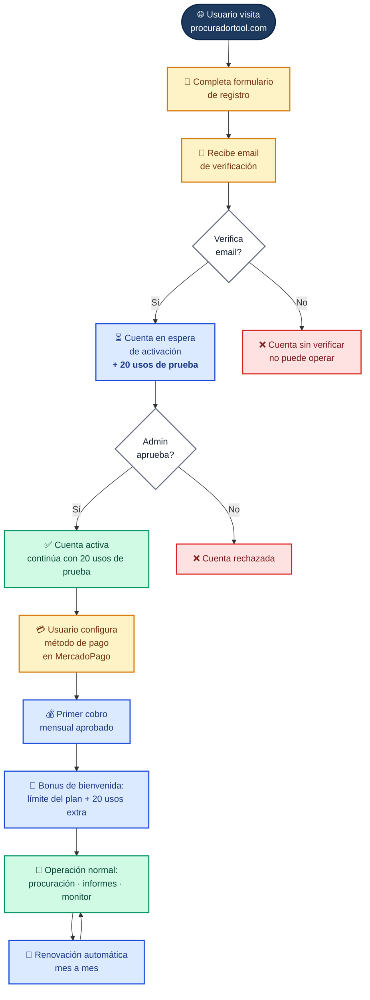
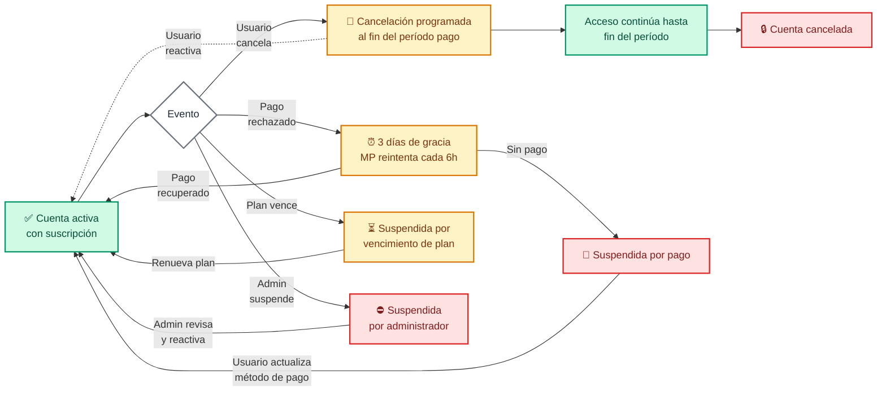

# Procurador SCW — Ciclo de vida del usuario

> Diagrama profesional del recorrido completo del usuario desde el registro hasta la operación recurrente.
> Última actualización: 2026-05-30

---

## 🎯 Camino principal (happy path)



---

## ⚠️ Caminos alternativos (situaciones especiales)



---

## 📊 Resumen de estados de la cuenta

| Estado | Significado | Acceso al servicio |
|---|---|:---:|
| 📧 **Pendiente verificación** | Usuario se registró pero no clickeó el email | ❌ |
| ⏳ **Pendiente activación** | Email verificado, 20 usos de prueba activos | ✅ (limitado) |
| ✅ **Activa** | Suscripción al día, cobro automático funcionando | ✅ |
| 📅 **Cancelación programada** | El usuario canceló, sigue con acceso hasta fin del período | ✅ (hasta fecha) |
| ⏰ **En período de gracia** | Pago rechazado, MP reintenta 3 días | ✅ |
| 🚫 **Suspendida por pago** | Pago no recuperado en 3 días | ❌ |
| ⏳ **Plan vencido** | Plan caducó | ❌ |
| ⛔ **Suspendida por admin** | Decisión administrativa | ❌ |
| 🔒 **Cancelada** | Período de la cancelación venció | ❌ |
| ❌ **Rechazada** | Trial agotado o rechazo administrativo | ❌ |

---

## 💡 Puntos clave para presentar

1. **Activación manual por admin** — control humano antes de habilitar la cuenta (filtro anti-fraude / cumplimiento)
2. **20 usos de prueba** antes del primer cobro — el usuario evalúa el producto antes de pagar
3. **Bonus de bienvenida** — +20 usos extra el primer mes pago, mejora retención inicial
4. **Cobro automático mensual** vía MercadoPago — sin intervención manual
5. **Gracia de 3 días** ante pago rechazado — evita perder clientes por errores transitorios
6. **Cancelación amigable** — el usuario puede cancelar y reactivar antes del fin del período
7. **Identificación robusta** — funciona aunque el usuario tenga distinto email en el portal y en MercadoPago

---

## 🖼️ Cómo exportar a imagen para presentación

**Opción 1 — Online (más rápido):**
1. Abrir https://mermaid.live
2. Copiar el código del diagrama (entre los ```mermaid)
3. Click "Actions" → "PNG" o "SVG"

**Opción 2 — GitHub:**
Este archivo se renderiza automáticamente al verlo en GitHub. Captura de pantalla → listo.

**Opción 3 — Notion / Slack:**
Pegar el código Mermaid en un bloque de código tipo `mermaid` y se renderiza automáticamente.

**Opción 4 — VS Code:**
Instalar la extensión "Markdown Preview Mermaid Support" → preview del .md → captura.
